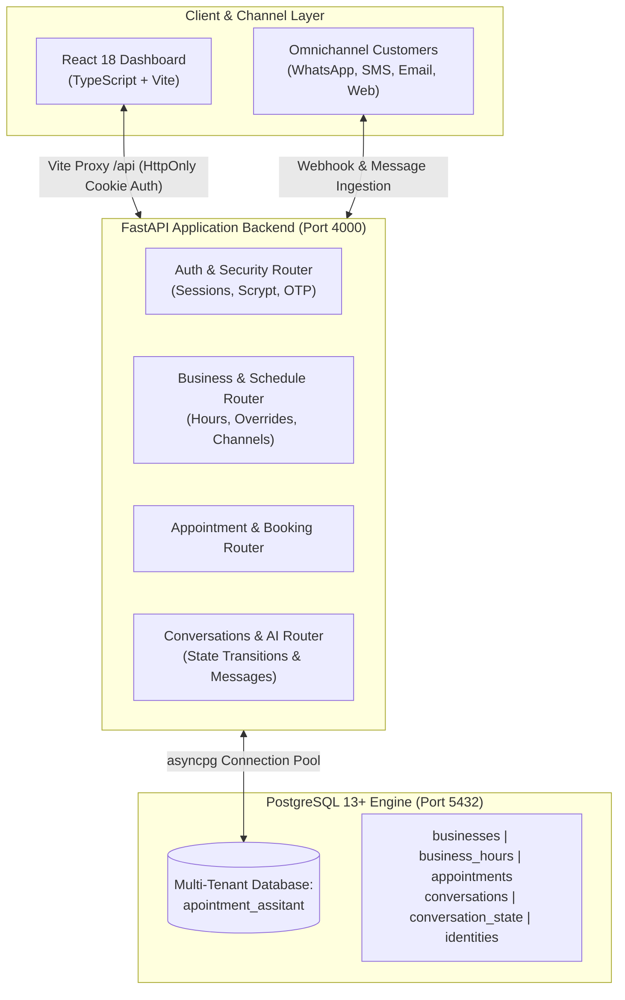

# AI Appointment Assistant — Multi-Tenant Dashboard & API

[](https://fastapi.tiangolo.com/)
[](https://react.dev/)
[](https://www.typescriptlang.org/)
[](https://www.postgresql.org/)
[](https://vitejs.dev/)
[](https://tailwindcss.com/)
[](LICENSE)

A production-oriented, full-stack, multi-tenant **AI Receptionist & Appointment Assistant** platform. The application provides an administrative dashboard and an asynchronous REST API connected to an enterprise-grade PostgreSQL data model. It orchestrates conversational booking workflows, omnichannel customer identities, dynamic business hours with holiday overrides, and AI conversation states.

---

## Table of Contents

- [System Architecture](#system-architecture)
- [Key Features](#key-features)
- [Tech Stack](#tech-stack)
- [Project Directory Structure](#project-directory-structure)
- [How to Run on Your Laptop (Local Setup)](#how-to-run-on-your-laptop-local-setup)
  - [1. Prerequisites](#1-prerequisites)
  - [2. Clone the Repository](#2-clone-the-repository)
  - [3. PostgreSQL Database Setup](#3-postgresql-database-setup)
  - [4. Configure Environment Variables](#4-configure-environment-variables)
  - [5. Backend Python Setup](#5-backend-python-setup)
  - [6. Frontend Node.js Setup](#6-frontend-nodejs-setup)
  - [7. Launch the Application](#7-launch-the-application)
- [Running Tests & Code Quality](#running-tests--code-quality)
- [API Surface & Endpoints](#api-surface--endpoints)
- [Database Model & ERD](#database-model--erd)
- [Security & Authentication](#security--authentication)
- [Production Deployment](#production-deployment)
- [Author](#author)

---

## System Architecture



---

## Key Features

- **Multi-Tenant Business Core**: Dedicated tenant settings, custom booking rules, daily appointment capacity caps, and IANA timezone enforcement.
- **Dynamic Business Hours & Overrides**: Weekly schedule configuration with fine-grained date-specific overrides for holidays and special hours.
- **Omnichannel Identity Mapping**: Unifies customer interactions across WhatsApp, Phone, SMS, Email, Instagram, and Website widgets into normalized tenant profiles.
- **AI Conversation State Engine**: Real-time state machine tracking conversational progress (`WAITING_CUSTOMER`, `WAITING_BUSINESS`, `ACTIVE`, `CLOSED`) with sequential message audits.
- **Full-Stack Security**:
  - `HttpOnly`, `SameSite=Lax` cookie sessions (no token leakage in localStorage).
  - Modern `scrypt` password hashing.
  - Expiring 6-digit verification and password-reset OTP codes.
  - Trusted origin checking and protection against Cross-Tenant data leaks through composite foreign keys.

---

## Tech Stack

| Component | Technology | Purpose |
| :--- | :--- | :--- |
| **Frontend** | React 18, TypeScript, Vite | Modern, high-performance administrative single-page dashboard |
| **Styling** | Modern CSS / Utility Classes | Responsive, high-contrast user interface |
| **Backend** | Python 3.10+, FastAPI, Uvicorn | High-throughput async REST API engine |
| **Database Driver** | `asyncpg` | Non-blocking binary protocol PostgreSQL driver |
| **Database** | PostgreSQL 13+ | Relational persistence with UUID keys, strict triggers, enums, and constraints |
| **Dev Tools** | `concurrently`, `pytest`, `httpx` | Unified local execution and end-to-end integration testing |

---

## Project Directory Structure

```plaintext
appointment_assistant/
├── backend/
│   ├── app/
│   │   ├── routers/            # Modular FastAPI endpoint routers
│   │   │   ├── appointments.py  # Appointment booking & scheduling
│   │   │   ├── auth.py          # Signup, email verify, login, reset
│   │   │   ├── business.py      # Business profile, hours & overrides
│   │   │   ├── conversations.py # AI conversations & messages
│   │   │   ├── customers.py     # Customer management & identities
│   │   │   └── dashboard.py     # Aggregated analytics & summaries
│   │   ├── config.py           # Typed environment variable loader
│   │   ├── db.py               # asyncpg database connection pool
│   │   ├── main.py             # FastAPI entrypoint & middleware setup
│   │   ├── schemas.py          # Pydantic validation models
│   │   └── security.py        # scrypt password hashing & session management
│   ├── tests/                  # Integration tests with pytest & httpx
│   ├── pyproject.toml          # Python project metadata
│   └── requirements.txt        # Backend dependencies
├── database/
│   ├── erd/
│   │   └── database_erd.pdf    # Full visual entity-relationship diagram
│   ├── migrations/             # Incremental database migration scripts
│   ├── constraints.sql         # Referential integrity & check constraints
│   ├── enums.sql               # PostgreSQL custom enum types
│   ├── indexes.sql             # Performance indexes
│   ├── schema.sql              # Authoritative complete production schema
│   ├── schema_snapshot.sql     # pg_dump schema verification snapshot
│   └── seed.sql                # Development sample tenant seed data
├── frontend/
│   ├── src/
│   │   ├── components/         # Shared UI cards, navigation, layout
│   │   ├── context/            # AuthContext & global state
│   │   ├── pages/              # Dashboard, Appointments, Conversations, Settings
│   │   ├── App.tsx             # Root router & route guards
│   │   └── main.tsx            # React application entrypoint
│   ├── index.html              # HTML shell
│   ├── package.json            # Frontend package configuration
│   └── vite.config.ts          # Vite build config with /api reverse proxy
├── .env.example                # Template of required environment variables
├── package.json                # Root npm scripts orchestration
└── README.md                   # Project documentation
```

---

## How to Run on Your Laptop (Local Setup)

Follow these step-by-step instructions to get the complete application running locally on your laptop.

### 1. Prerequisites

Make sure the following software packages are installed on your machine:
- **Node.js**: `v20.x` or `v22.x` ([Download Node.js](https://nodejs.org/))
- **Python**: `3.10` or higher (`python3 --version`)
- **PostgreSQL**: `13` or higher (`psql --version`)
- **Git**: installed and configured

---

### 2. Clone the Repository

```bash
git clone https://github.com/Umair-Nawaz0/appointment-assistant.git
cd appointment-assistant
```

---

### 3. PostgreSQL Database Setup

1. Start your local PostgreSQL service:
   ```bash
   # On Ubuntu/Debian:
   sudo systemctl start postgresql
   
   # On macOS (Homebrew):
   brew services start postgresql@14
   ```

2. Create the target database (named `apointment_assitant`) and set your local user as owner:
   ```bash
   # Create database owned by your current user:
   createdb apointment_assitant
   
   # Or using psql with postgres superuser:
   sudo -u postgres createdb --owner=$(whoami) apointment_assitant
   ```

3. Load the authoritative database schema:
   ```bash
   psql -d apointment_assitant -f database/schema.sql
   ```

4. *(Optional)* Load demo development seed data:
   ```bash
   psql -d apointment_assitant -f database/seed.sql
   ```

---

### 4. Configure Environment Variables

Copy the `.env.example` file to `.env` in the root directory:

```bash
cp .env.example .env
```

Open `.env` in your code editor and verify the parameters:

```dotenv
NODE_ENV=development
PORT=4000
APP_URL=http://localhost:5173
FRONTEND_ORIGIN=http://localhost:5173
FRONTEND_ORIGINS=http://localhost:5173,http://127.0.0.1:5173

# PostgreSQL connection parameters
PGHOST=/var/run/postgresql    # or localhost
PGPORT=5432
PGDATABASE=apointment_assitant
PGUSER=your_username          # your local postgres username
PGPASSWORD=your_password      # leave empty if using local peer auth

# Session & security configurations
SESSION_COOKIE_NAME=appointment_session
SESSION_TTL_DAYS=7
EMAIL_VERIFICATION_CODE_TTL_MINUTES=15
PASSWORD_RESET_TTL_MINUTES=60

# Email Mode: "console" prints OTP verification codes in terminal during local dev
MAIL_MODE=console
MAIL_FROM=Appointment Assistant <no-reply@example.com>
```

> [!TIP]
> In local development, `MAIL_MODE=console` will output 6-digit email verification and password reset codes directly into your terminal log and the UI, so no third-party SMTP server is needed!

---

### 5. Backend Python Setup

Create and activate a Python virtual environment, then install backend requirements:

```bash
# From the project root:
python3 -m venv backend/.venv

# Activate virtual environment:
source backend/.venv/bin/activate

# Upgrade pip and install dependencies:
pip install --upgrade pip
pip install -r backend/requirements.txt
```

---

### 6. Frontend Node.js Setup

Install all frontend dependencies from the root directory:

```bash
npm install
```

---

### 7. Launch the Application

#### Option A: One-Command Startup (Recommended)
Run both backend and frontend concurrently using the root npm script:

```bash
npm run dev
```

#### Option B: Run in Separate Terminal Windows

- **Terminal 1 (FastAPI Backend)**:
  ```bash
  backend/.venv/bin/uvicorn backend.app.main:app --reload --host 127.0.0.1 --port 4000
  ```

- **Terminal 2 (React Frontend)**:
  ```bash
  npm run dev --workspace frontend
  ```

#### Accessing the Local Services:
- 🌐 **Web Dashboard UI**: [http://localhost:5173](http://localhost:5173)
- 🔌 **FastAPI REST API**: [http://127.0.0.1:4000](http://127.0.0.1:4000)
- 📖 **Interactive Swagger API Documentation**: [http://127.0.0.1:4000/docs](http://127.0.0.1:4000/docs)
- 🔍 **ReDoc Documentation**: [http://127.0.0.1:4000/redoc](http://127.0.0.1:4000/redoc)

---

## Running Tests & Code Quality

Validate TypeScript types and run backend integration test suites:

```bash
# 1. Typecheck frontend TypeScript:
npm run typecheck

# 2. Production build check:
npm run build

# 3. Run backend pytest test suite:
npm run test:backend
# or directly:
backend/.venv/bin/pytest -q backend/tests
```

The test suite tests session generation, business onboarding, business hours, customer identity mapping, appointments, and conversation state machines.

---

## API Surface & Endpoints

All responses are formatted in JSON. Authentication is maintained via the `appointment_session` `HttpOnly` cookie.

| Category | Method | Endpoint | Description |
| :--- | :---: | :--- | :--- |
| **Auth** | `POST` | `/api/auth/signup` | Register new business tenant profile |
| **Auth** | `POST` | `/api/auth/verify-email` | Verify email using 6-digit OTP code |
| **Auth** | `POST` | `/api/auth/login` | Authenticate and issue HttpOnly session cookie |
| **Auth** | `POST` | `/api/auth/logout` | Revoke session and clear cookies |
| **Auth** | `GET` | `/api/auth/me` | Fetch active tenant identity |
| **Dashboard** | `GET` | `/api/dashboard/summary` | Retrieve KPI metrics, booking counts, activity feed |
| **Business** | `GET/PUT` | `/api/business` | View or modify business profile & contact info |
| **Business** | `GET/PUT` | `/api/business/settings` | Update booking policy & daily capacity |
| **Business** | `GET/PUT` | `/api/business/hours` | Configure weekly operational schedule |
| **Business** | `POST/DEL`| `/api/business/overrides/:date`| Set holiday or special hours override |
| **Business** | `GET/POST`| `/api/business/channels/:ch` | Enable/configure messaging channel |
| **Customers** | `GET/POST`| `/api/customers` | Query and create tenant customer records |
| **Customers** | `POST` | `/api/customers/:id/identities`| Bind new phone/email/channel identity |
| **Appointments**| `GET/POST`| `/api/appointments` | List and book appointments |
| **Appointments**| `PATCH` | `/api/appointments/:id` | Update status (`CONFIRMED`, `CANCELLED`, etc.) |
| **Conversations**| `GET` | `/api/conversations` | List conversation threads across channels |
| **Conversations**| `POST` | `/api/conversations/:id/messages`| Send customer reply or AI prompt message |
| **Conversations**| `PATCH` | `/api/conversations/:id/state` | Update AI conversation state and memory |

---

## Database Model & ERD

The complete visual Entity Relationship Diagram is available in [`database/erd/database_erd.pdf`](database/erd/database_erd.pdf).

### Key Architectural Invariants:
1. **Strict Tenant Isolation**: `business_id` is repeated on child tables with composite foreign keys `(business_id, customer_id)` to prevent cross-business data leaks.
2. **Deterministic State Machine**: Every active conversation maintains exactly one row in `conversation_state` with transactional locking.
3. **Audit History Preservation**: Snapshot columns on appointments store customer contact values at booking time so future profile modifications never distort past records.

---

## Security & Authentication

- **Zero Client-Side Token Storage**: Sensitive JWTs or session tokens are never placed in browser `localStorage` or `sessionStorage`.
- **Scrypt Password Hashing**: Utilizes modern cryptographic key derivation with work factor configuration.
- **Strict Origin Validation**: Blocks cross-origin requests unless explicitly whitelisted in `FRONTEND_ORIGINS`.
- **Rate-Limiting & Attempt Caps**: Limits incorrect password and verification code attempts to prevent brute-force exploitation.

---

## Production Deployment

To package and run the application for production:

```bash
# 1. Compile frontend assets into backend-served static bundle:
npm run build

# 2. Run backend in production mode:
NODE_ENV=production backend/.venv/bin/uvicorn backend.app.main:app --host 0.0.0.0 --port 4000 --workers 4
```

Place the Uvicorn service behind an HTTPS reverse proxy (such as Nginx, Caddy, or Cloudflare) to ensure secure session cookies are transmitted safely.

---

## Author

**Umair Nawaz**  
- GitHub: [@Umair-Nawaz0](https://github.com/Umair-Nawaz0)
